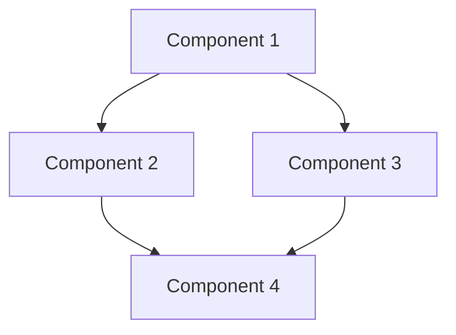

# Research Decomposition

Break the assessed research into discrete, shippable components.

## Workflow

1. **Read assessment**: Load `.r2r/01-assessment.md` (or provided path)
2. **Identify components**: Extract distinct functional units
3. **Define boundaries**: Clarify what's in/out of each component
4. **Map dependencies**: Identify which components depend on others
5. **Estimate scope**: T-shirt size each component (S/M/L/XL)
6. **Write output**: Save to `.r2r/02-components.md`

## Decomposition Principles

- **Single responsibility**: Each component does one thing well
- **Shippable**: Each component can be deployed independently (or clearly staged)
- **Testable**: Clear success criteria for each component
- **Bounded**: Explicit interfaces between components

## Component Types

Identify these categories:
- **Core**: Essential functionality from the research
- **Infrastructure**: Supporting systems needed for production
- **Integration**: Connections to existing systems
- **Migration**: Data or state transitions
- **Observability**: Monitoring, logging, alerting
- **Documentation**: User docs, API docs, runbooks

## Output Format

Write to `.r2r/02-components.md`:

```markdown
---
phase: decomposition
created: [ISO timestamp]
source: .r2r/01-assessment.md
component_count: [count]
status: complete
---

# Component Decomposition: [Project Name]

## Overview

[1-2 sentences describing the decomposition approach]

Total components identified: [X]

## Component Map



## Components

### 1. [Component Name]

**Type**: Core | Infrastructure | Integration | Migration | Observability | Documentation

**Description**: [What this component does]

**Scope**: S | M | L | XL

**Boundaries**:
- Includes: [what's in scope]
- Excludes: [what's out of scope]

**Dependencies**:
- Depends on: [list]
- Blocks: [list]

**Success Criteria**:
- [ ] [Criterion 1]
- [ ] [Criterion 2]

**Technical Notes**:
[Any implementation considerations]

---

### 2. [Component Name]
[Repeat structure...]

---

## Dependency Matrix

| Component | Depends On | Blocks |
|-----------|------------|--------|
| Component 1 | - | 2, 3 |
| Component 2 | 1 | 4 |
| Component 3 | 1 | 4 |
| Component 4 | 2, 3 | - |

## Scope Summary

| Size | Count | Components |
|------|-------|------------|
| S | X | [names] |
| M | X | [names] |
| L | X | [names] |
| XL | X | [names] |

## Open Questions

- [Question needing clarification]
- [Question needing clarification]
```

## State Update

Update `.r2r/state.json`:

```json
{
  "current_phase": "decomposition",
  "completed_phases": ["assessment", "decomposition"],
  "last_updated": "[ISO timestamp]",
  "component_count": [count]
}
```

## Tips

- Aim for 5-15 components (fewer = too coarse, more = too granular)
- Every component should have at least one success criterion
- Use T-shirt sizes consistently: S (<1 week), M (1-2 weeks), L (2-4 weeks), XL (>4 weeks)
- Flag circular dependencies as risks
