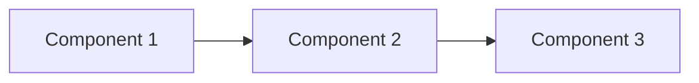

# Prioritization & Horizon Planning

Analyze components for effort/impact and assign to planning horizons.

## Workflow

1. **Read components**: Load `.r2r/02-components.md`
2. **Score impact**: Rate each component's value (1-10)
3. **Score effort**: Rate each component's cost (1-10)
4. **Calculate priority**: Impact/Effort ratio
5. **Assign horizons**: Place in H1/H2/H3 based on priority and dependencies
6. **Write output**: Save to `.r2r/03-priorities.md`

## Horizon Definitions

| Horizon | Timeframe | Focus | Certainty |
|---------|-----------|-------|-----------|
| **H1** | 0-3 months | Ship validated, high-impact features | High (80%+) |
| **H2** | 3-6 months | Extend, optimize, iterate | Medium (50-80%) |
| **H3** | 6-12 months | Explore, experiment, future-proof | Low (<50%) |

## Scoring Criteria

**Impact (1-10):**
- 10: Critical path, blocks everything else
- 7-9: High value, significant user/business impact
- 4-6: Medium value, nice-to-have
- 1-3: Low value, could defer indefinitely

**Effort (1-10):**
- 10: XL+ (months of work, high complexity)
- 7-9: L (weeks of work, significant complexity)
- 4-6: M (week of work, moderate complexity)
- 1-3: S (days of work, low complexity)

## Output Format

Write to `.r2r/03-priorities.md`:

```markdown
---
phase: prioritization
created: [ISO timestamp]
source: .r2r/02-components.md
h1_count: [count]
h2_count: [count]
h3_count: [count]
status: complete
---

# Prioritization: [Project Name]

## Executive Summary

- **H1 (Now)**: [X] components - [brief description]
- **H2 (Next)**: [X] components - [brief description]
- **H3 (Later)**: [X] components - [brief description]

## Priority Matrix

```mermaid
quadrantChart
    title Effort vs Impact
    x-axis Low Effort --> High Effort
    y-axis Low Impact --> High Impact
    quadrant-1 Big Bets (H2)
    quadrant-2 Quick Wins (H1)
    quadrant-3 Fill-ins (H3)
    quadrant-4 Avoid
    Component1: [0.3, 0.8]
    Component2: [0.7, 0.9]
```

## Scoring Table

| Component | Impact | Effort | Ratio | Horizon | Rationale |
|-----------|--------|--------|-------|---------|-----------|
| [Name] | 9 | 3 | 3.0 | H1 | [Why] |
| [Name] | 8 | 7 | 1.1 | H2 | [Why] |
| [Name] | 4 | 8 | 0.5 | H3 | [Why] |

## H1: Ship Now (0-3 months)

### Priority Order
1. **[Component]** - Impact: X, Effort: X
   - Rationale: [Why this is H1]
   - Dependencies: [What must come first]
   - Success looks like: [Outcome]

2. **[Component]** - Impact: X, Effort: X
   [...]

### H1 Dependency Chain


## H2: Build Next (3-6 months)

### Priority Order
1. **[Component]** - Impact: X, Effort: X
   - Rationale: [Why H2 not H1]
   - Blocked by: [H1 items]

## H3: Plan Later (6-12 months)

### Priority Order
1. **[Component]** - Impact: X, Effort: X
   - Rationale: [Why deferrable]
   - Revisit when: [Trigger condition]

## Risk-Adjusted Notes

- [Component X] moved to H2 due to [risk]
- [Component Y] promoted to H1 because [dependency]

## Quick Wins (Do Immediately)

These can be done in parallel with main H1 work:
- [ ] [Quick win 1]
- [ ] [Quick win 2]
```

## State Update

Update `.r2r/state.json`:

```json
{
  "current_phase": "prioritization",
  "completed_phases": ["assessment", "decomposition", "prioritization"],
  "last_updated": "[ISO timestamp]",
  "horizons": {
    "h1": [count],
    "h2": [count],
    "h3": [count]
  }
}
```

## Tips

- H1 should be achievable with current team/resources
- Dependencies trump priority scores (blocker = H1 regardless of score)
- Include at least one quick win in H1 for early momentum
- H3 items should have clear "revisit triggers"
