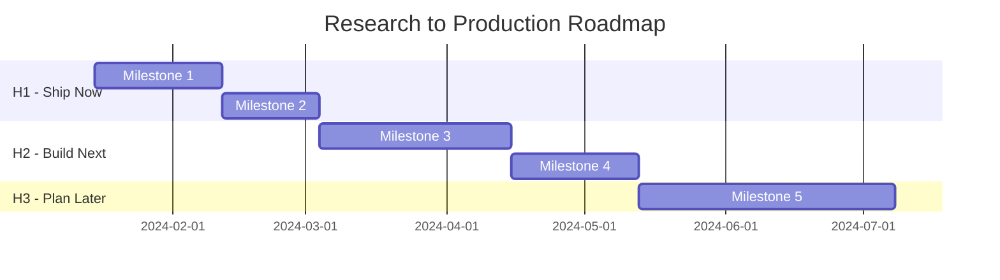
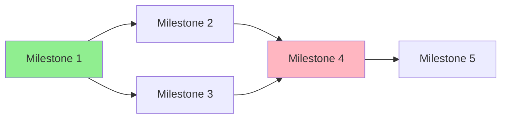

# Roadmap Generation

Generate a complete, structured roadmap from prioritized components.

## Workflow

1. **Read priorities**: Load `.r2r/03-priorities.md`
2. **Structure milestones**: Convert H1/H2/H3 into concrete milestones
3. **Define deliverables**: Specify what ships at each milestone
4. **Create timeline**: Build visual Mermaid Gantt chart
5. **Add success criteria**: Define how we know each milestone is done
6. **Generate stakeholder views**: Create exec/eng/PM summaries
7. **Write output**: Save to `.r2r/04-roadmap.md`

## Milestone Design (SMART)

Each milestone must be:
- **S**pecific: Clear, unambiguous deliverable
- **M**easurable: Quantifiable success criteria
- **A**chievable: Realistic with available resources
- **R**elevant: Tied to research-to-prod goals
- **T**ime-bound: Has a target date

## Output Format

Write to `.r2r/04-roadmap.md`:

```markdown
---
phase: roadmap
created: [ISO timestamp]
source: .r2r/03-priorities.md
milestone_count: [count]
target_completion: [date]
status: complete
---

# Production Roadmap: [Project Name]

## Executive Summary

**Goal**: [One sentence describing what we're shipping]

**Timeline**: [Start date] → [End date]

**Key Milestones**:
1. [Milestone 1] - [Target date]
2. [Milestone 2] - [Target date]
3. [Milestone 3] - [Target date]

## Visual Timeline



## Detailed Milestones

### Milestone 1: [Name]

**Horizon**: H1
**Target Date**: [YYYY-MM-DD]
**Duration**: [X weeks]

**Description**: [What this milestone delivers]

**Deliverables**:
- [ ] [Deliverable 1]
- [ ] [Deliverable 2]
- [ ] [Deliverable 3]

**Success Criteria**:
- [ ] [Measurable criterion 1]
- [ ] [Measurable criterion 2]

**Dependencies**:
- Requires: [What must be done first]
- Enables: [What this unlocks]

**Risks**:
- [Risk 1]: Mitigation: [action]
- [Risk 2]: Mitigation: [action]

**Resources Needed**:
- [Resource 1]
- [Resource 2]

---

### Milestone 2: [Name]
[Repeat structure...]

---

## Release Phases

Map milestones to GitHub-style release phases:

### Phase Timeline

| Phase | Milestones | Exit Criteria | Duration |
|-------|------------|---------------|----------|
| Internal Build | M1 | 5+ internal users, no P0 bugs | 2-4 weeks |
| Private Preview | M2-M3 | 50+ external users, NPS >30 | 4-8 weeks |
| Public Preview | M4 | 1000+ users, SLA met | 6-12 weeks |
| GA | M5 | Security audit, support ready | - |

### Graduation Criteria per Phase

**Internal → Private Preview:**
- [ ] Core hypothesis validated with evidence
- [ ] Basic functionality works for happy path
- [ ] No obvious security vulnerabilities
- [ ] Clear problem statement documented
- [ ] Initial feedback from 3+ internal users

**Private → Public Preview:**
- [ ] 50+ external users actively using
- [ ] User retention >50% weekly
- [ ] Support volume manageable
- [ ] Security review completed
- [ ] Documentation complete

**Public Preview → GA:**
- [ ] Load tested at 10x current usage
- [ ] All P0/P1 bugs fixed
- [ ] Security audit passed
- [ ] SLA commitments achievable
- [ ] On-call rotation established

## Stakeholder Views

### Executive Summary (1 paragraph)

[High-level summary for leadership: what, why, when, impact]

### Engineering View

| Milestone | Tech Stack | Complexity | Key Risks |
|-----------|------------|------------|-----------|
| M1 | [stack] | Medium | [risk] |
| M2 | [stack] | High | [risk] |

### Product Manager View

| Milestone | User Value | Success Metric | Launch Type |
|-----------|------------|----------------|-------------|
| M1 | [value] | [metric] | Internal |
| M2 | [value] | [metric] | Beta |

## Dependencies & Critical Path



**Critical Path**: M1 → M2 → M4 → M5

## Risk Register

| Risk | Probability | Impact | Mitigation | Owner |
|------|-------------|--------|------------|-------|
| [Risk 1] | High | High | [Action] | [TBD] |
| [Risk 2] | Medium | Medium | [Action] | [TBD] |

## Open Questions

- [ ] [Question requiring decision]
- [ ] [Question requiring decision]

## Next Actions

1. [ ] Review roadmap with stakeholders
2. [ ] Assign owners to milestones
3. [ ] Run pre-mortem validation (/r2r:validate)
```

## State Update

Update `.r2r/state.json`:

```json
{
  "current_phase": "roadmap",
  "completed_phases": ["assessment", "decomposition", "prioritization", "roadmap"],
  "last_updated": "[ISO timestamp]",
  "milestone_count": [count],
  "target_completion": "[date]"
}
```

## Tips

- Keep milestone count reasonable (5-10 milestones for most projects)
- Critical path should be clearly identified
- Every milestone needs at least one measurable success criterion
- Include buffer time for unknowns (especially in H2/H3)
- Stakeholder views should be copy-pasteable for different audiences
