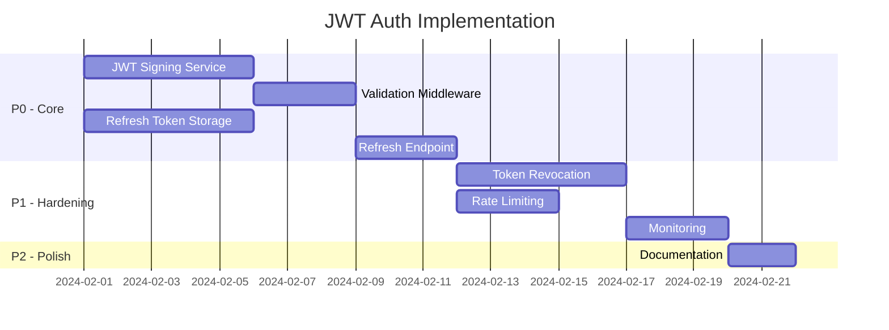

# ADR to Production Breakdown Example

Demonstrates converting an ADR into actionable production tasks.

---

## Source ADR: Authentication Strategy

**ADR-001**: Use JWT with refresh tokens for API authentication

### Decision Summary
- **Context**: Need stateless auth for distributed microservices
- **Decision**: JWT access tokens (15min) + refresh tokens (7 days)
- **Consequences**: Need token storage, refresh logic, revocation strategy

---

## Production Breakdown

### Component Decomposition

| Component | Size | Priority | Dependencies |
|-----------|------|----------|--------------|
| JWT signing service | M | P0 | None |
| Token validation middleware | S | P0 | Signing service |
| Refresh token storage | M | P0 | Database |
| Token refresh endpoint | S | P0 | Storage, signing |
| Token revocation | M | P1 | Storage |
| Rate limiting | S | P1 | Redis |
| Monitoring/alerting | M | P1 | Observability stack |
| Documentation | S | P2 | All above |

### Task Breakdown by Component

#### 1. JWT Signing Service (M - 1 week)

**Tasks**:
- [ ] Set up key management (AWS KMS or Vault)
- [ ] Implement signing logic with RS256
- [ ] Add key rotation support
- [ ] Write unit tests
- [ ] Load test signing performance

**Success Criteria**:
- Signs 1000 tokens/second
- Key rotation without downtime
- 100% test coverage on signing logic

**Risks**:
- Key management complexity → Mitigate with managed service (KMS)

---

#### 2. Token Validation Middleware (S - 3 days)

**Tasks**:
- [ ] Implement JWT validation
- [ ] Add to API gateway
- [ ] Handle expired token responses
- [ ] Write integration tests

**Success Criteria**:
- Validates tokens in <5ms
- Proper 401 responses for invalid tokens
- Works with all existing endpoints

**Dependencies**: JWT signing service must be complete

---

#### 3. Refresh Token Storage (M - 1 week)

**Tasks**:
- [ ] Design database schema
- [ ] Implement CRUD operations
- [ ] Add token family tracking (for rotation)
- [ ] Set up TTL/cleanup job
- [ ] Write migration scripts

**Schema**:
```sql
CREATE TABLE refresh_tokens (
  id UUID PRIMARY KEY,
  user_id UUID NOT NULL,
  token_hash VARCHAR(64) NOT NULL,
  family_id UUID NOT NULL,
  expires_at TIMESTAMP NOT NULL,
  revoked_at TIMESTAMP,
  created_at TIMESTAMP DEFAULT NOW()
);
```

**Success Criteria**:
- Stores 1M tokens without performance degradation
- Cleanup job runs without blocking queries

---

#### 4. Token Refresh Endpoint (S - 3 days)

**Tasks**:
- [ ] Implement refresh endpoint
- [ ] Add refresh token rotation
- [ ] Handle concurrent refresh requests
- [ ] Write integration tests

**API**:
```
POST /auth/refresh
Body: { refresh_token: string }
Response: { access_token: string, refresh_token: string }
```

**Success Criteria**:
- Handles 100 concurrent refreshes
- Old refresh token invalidated after use
- Graceful handling of race conditions

---

#### 5. Token Revocation (M - 1 week)

**Tasks**:
- [ ] Implement single token revocation
- [ ] Implement user-wide revocation
- [ ] Add revocation check to validation
- [ ] Build admin UI for revocation

**Success Criteria**:
- Revocation takes effect within 1 minute
- Admin can revoke all user tokens
- Revocation survives service restart

---

### Timeline (H1)



### ADR Health Check

| Aspect | Status | Notes |
|--------|--------|-------|
| Decision still valid? | ✅ | JWT remains best fit for stateless auth |
| Dependencies available? | ✅ | KMS, Redis, Postgres all available |
| Team has skills? | ⚠️ | Need security review from infosec |
| Timeline realistic? | ✅ | 4 weeks for P0, 6 weeks total |
| Risks identified? | ✅ | Key management, token theft addressed |

### Open Questions from ADR

| Question | Answer | Impact |
|----------|--------|--------|
| Token length? | 15 min access, 7 day refresh | Implemented as configurable |
| Revocation strategy? | Blocklist + family invalidation | Added to P1 scope |
| Multi-device support? | Yes, multiple refresh tokens per user | Schema supports this |
