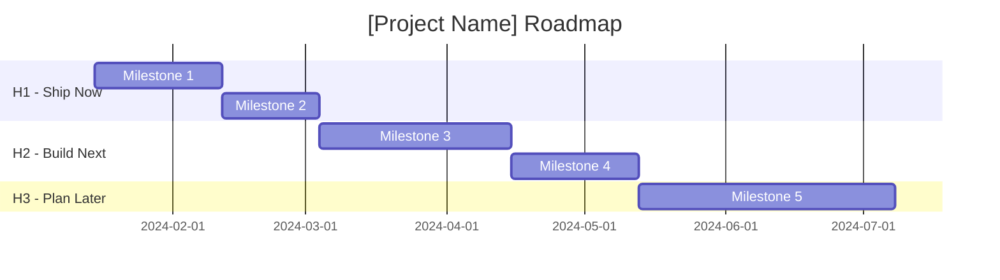
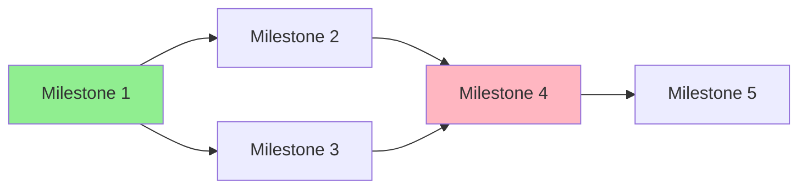

# Roadmap Patterns

Patterns and templates for creating production roadmaps from research.

## When to Use

- Planning horizons for research-to-production transitions
- Structuring milestones with measurable deliverables
- Backcasting from production deadlines
- Creating stakeholder-appropriate roadmap views
- Designing milestone dependencies and critical paths

## H1/H2/H3 Horizon Planning

Three-horizon framework for balancing certainty with ambition:

| Horizon | Timeframe | Focus | Certainty | Planning Detail |
|---------|-----------|-------|-----------|-----------------|
| **H1** | 0-3 months | Ship validated features | High (80%+) | Detailed tasks, assigned owners |
| **H2** | 3-6 months | Extend and optimize | Medium (50-80%) | Milestones defined, rough tasks |
| **H3** | 6-12 months | Explore and experiment | Low (<50%) | Themes only, flexible scope |

### H1: Ship Now (0-3 months)

**Characteristics:**
- High confidence in scope and timeline
- Clear success criteria
- Resources allocated
- Dependencies understood
- Ready to execute

**What belongs in H1:**
- Validated features from research
- Critical path items
- Quick wins for momentum
- Blockers for later work

### H2: Build Next (3-6 months)

**Characteristics:**
- Medium confidence
- Scope defined, tasks rough
- Dependent on H1 completion
- May shift based on H1 learnings

**What belongs in H2:**
- Extensions of H1 features
- Optimization work
- Technical debt paydown
- Features needing more validation

### H3: Plan Later (6-12 months)

**Characteristics:**
- Low confidence, high flexibility
- Themes and directions, not specific features
- Revisit quarterly
- Placeholder for strategic bets

**What belongs in H3:**
- Exploratory features
- Major architectural changes
- Long-term investments
- "Would be nice" items

## Backcast Planning

Work backward from target state to identify the path.

### Process

1. **Define target state**: What does "production" look like?
2. **Identify final milestone**: What's the last thing before launch?
3. **Work backward**: What must be done before that?
4. **Map dependencies**: Build the chain
5. **Assign to horizons**: Place in H1/H2/H3

### Template

```markdown
## Backcast: [Project Name]

### Target State (Production)
[Describe what "done" looks like]

### Final Milestone (Launch Gate)
- What: [Deliverable]
- Requires: [Prerequisites]

### Milestone N-1
- What: [Deliverable]
- Requires: [Prerequisites]
- Enables: [Final Milestone]

### Milestone N-2
[Continue backward...]

### Starting Point
- Current state: [Where we are]
- First step: [Initial milestone]
```

## Stakeholder Views

Different audiences need different views of the same roadmap.

### Executive View

**Focus:** Business value, timeline, top risks
**Format:** One paragraph + key milestones
**Language:** Outcomes, not implementation

```markdown
## Executive Summary

[Project Name] will deliver [business outcome] by [date]. Key milestones:

| Milestone | Date | Business Value |
|-----------|------|----------------|
| [M1] | [Date] | [Outcome] |
| [M2] | [Date] | [Outcome] |

**Top Risks:** [2-3 key risks with mitigations]
```

### Engineering View

**Focus:** Technical approach, complexity, risks
**Format:** Table with technical details
**Language:** Technical specifics

```markdown
## Engineering View

| Milestone | Tech Stack | Complexity | Key Risks | Dependencies |
|-----------|------------|------------|-----------|--------------|
| [M1] | [Stack] | Medium | [Risk] | [Deps] |
| [M2] | [Stack] | High | [Risk] | [Deps] |

**Architecture Notes:** [Key technical decisions]
**Technical Debt:** [Items to address]
```

### Product Manager View

**Focus:** User value, success metrics, launch type
**Format:** Table with user impact
**Language:** User-centric outcomes

```markdown
## Product View

| Milestone | User Value | Success Metric | Launch Type |
|-----------|------------|----------------|-------------|
| [M1] | [Value] | [Metric] | Internal |
| [M2] | [Value] | [Metric] | Beta |

**User Journey:** [How this changes user experience]
**Metrics to Track:** [KPIs for success]
```

## Milestone Design Patterns

### SMART Milestones

Every milestone must be:

- **S**pecific: "Deploy caching layer" not "Improve performance"
- **M**easurable: "Reduce p99 latency to <200ms" not "Make it faster"
- **A**chievable: Realistic given resources and constraints
- **R**elevant: Directly supports production readiness
- **T**ime-bound: "Complete by 2024-03-15" not "Q1 sometime"

### Milestone Template

```markdown
### Milestone: [Name]

**Horizon:** H1 | H2 | H3
**Target Date:** YYYY-MM-DD
**Duration:** X weeks
**Owner:** [TBD/Name]

**Description:**
[What this milestone delivers in 1-2 sentences]

**Deliverables:**
- [ ] [Specific deliverable 1]
- [ ] [Specific deliverable 2]

**Success Criteria:**
- [ ] [Measurable criterion 1]
- [ ] [Measurable criterion 2]

**Dependencies:**
- Requires: [What must be done first]
- Enables: [What this unlocks]

**Risks:**
| Risk | Probability | Impact | Mitigation |
|------|-------------|--------|------------|
| [Risk] | Med | High | [Action] |

**Resources:**
- [Resource 1]
- [Resource 2]
```

## Timeline Visualization

### Mermaid Gantt Template



### Dependency Graph Template



## Common Anti-Patterns

Avoid these roadmap mistakes:

| Anti-Pattern | Problem | Solution |
|--------------|---------|----------|
| No buffer | Timeline slip | Add 20-30% buffer |
| Vague milestones | Can't track progress | SMART criteria required |
| Everything is H1 | Nothing is prioritized | Force ruthless prioritization |
| Missing dependencies | Surprises mid-project | Map all dependencies upfront |
| No quick wins | Momentum stalls | Include easy wins in H1 |
| Single critical path | High risk | Identify parallel opportunities |

## Release Phases (GitHub-Style)

Map milestones to progressive release phases:

```
Internal Build → Private Preview → Public Preview → GA
    (Alpha)        (Limited Beta)   (Open Beta)    (Launch)
```

| Phase | Audience | SLA | Breaking Changes |
|-------|----------|-----|------------------|
| Internal | Team only | None | Frequent |
| Private Preview | Invited users | None | Expected |
| Public Preview | Self-service | Limited | Possible with notice |
| GA | Everyone | Yes | Rarely |

See `references/release-phases.md` for detailed phase criteria and feature flag lifecycle.

## References

See `references/` for:
- `timeline-estimation.md` - How to estimate milestone duration
- `dependency-patterns.md` - Common dependency patterns
- `release-phases.md` - Internal → Private → Public → GA phases
- `validation-ramp.md` - Progressive validation gates and kill criteria

See `examples/` for:
- `h1-h2-h3-roadmap-example.md` - Complete roadmap with release phases and graduation criteria
- `feature-flag-lifecycle-example.md` - Full flag lifecycle from creation to cleanup
