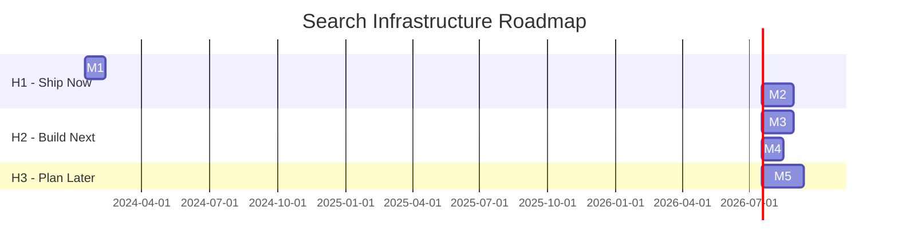

# Roadmap Example: Search Infrastructure Upgrade

Demonstrates H1/H2/H3 horizon planning with release phases.

---

# Production Roadmap: Search Infrastructure Upgrade

## Executive Summary

**Goal**: Replace legacy Elasticsearch with pgvector-based search, improving relevance by 40% while reducing infrastructure costs by 60%.

**Timeline**: 2024-Q1 → 2024-Q3 (6 months)

**Key Milestones**:
1. M1: Vector search MVP (Internal Build) - Feb 15
2. M2: Hybrid search + migration tooling (Private Preview) - Mar 30
3. M3: Full migration + observability (Public Preview) - May 15
4. M4: Legacy deprecation (GA) - Jun 30

## Visual Timeline

## Release Phases

| Phase | Milestones | Exit Criteria | Duration |
|-------|------------|---------------|----------|
| Internal Build | M1 | 5+ internal users, no P0 bugs | 4 weeks |
| Private Preview | M2 | 50+ users, NPS >30, <1 ticket/10 users | 6 weeks |
| Public Preview | M3 | 500+ users, SLA met, security audit passed | 6 weeks |
| GA | M4 | Legacy fully deprecated, support ready | 4 weeks |

## Detailed Milestones

### Milestone 1: Vector Search MVP

**Horizon**: H1
**Target Date**: 2024-02-15
**Duration**: 4 weeks
**Release Phase**: Internal Build

**Description**: Basic vector search working end-to-end for internal testing.

**Deliverables**:
- [x] pgvector extension deployed to staging
- [x] Embedding pipeline for documents
- [x] Search API endpoint
- [x] Basic relevance testing

**Success Criteria**:
- [x] 5+ internal users searching daily
- [x] p95 latency <200ms
- [x] Relevance score >0.7 on test queries

**Graduation Criteria (→ Private Preview)**:
- [x] Core hypothesis validated
- [x] No P0 bugs in happy path
- [ ] Rate limiting implemented
- [ ] Design partners identified

---

### Milestone 2: Hybrid Search + Migration

**Horizon**: H1
**Target Date**: 2024-03-30
**Duration**: 6 weeks
**Release Phase**: Private Preview

**Description**: Combine vector and keyword search, build migration tooling for gradual rollout.

**Deliverables**:
- [ ] Hybrid search algorithm
- [ ] A/B testing framework
- [ ] Data migration scripts
- [ ] Rollback procedures

**Success Criteria**:
- [ ] 50+ external users in preview
- [ ] 15% relevance improvement over keyword-only
- [ ] Migration tested on copy of production data

**Graduation Criteria (→ Public Preview)**:
- [ ] User retention >50%
- [ ] Support volume manageable
- [ ] Security review completed

**Feature Flags**:
- `search_vector_enabled_v1` - Enable vector search
- `search_hybrid_ratio_v1` - Control vector vs keyword weight

---

### Milestone 3: Full Migration

**Horizon**: H2
**Target Date**: 2024-05-15
**Duration**: 6 weeks
**Release Phase**: Public Preview

**Description**: Migrate all users to new search, full observability stack.

**Deliverables**:
- [ ] 100% traffic on new search
- [ ] Elasticsearch read replica (fallback)
- [ ] Full metrics dashboard
- [ ] Runbooks for common issues

**Success Criteria**:
- [ ] 500+ users on new search
- [ ] p99 latency <500ms at full load
- [ ] Error rate <0.1%

**Graduation Criteria (→ GA)**:
- [ ] Load tested at 10x current
- [ ] Security audit passed
- [ ] On-call rotation established

---

### Milestone 4: Legacy Deprecation

**Horizon**: H2
**Target Date**: 2024-06-30
**Duration**: 4 weeks
**Release Phase**: GA

**Description**: Decommission Elasticsearch, remove feature flags, full production support.

**Deliverables**:
- [ ] Elasticsearch cluster decommissioned
- [ ] Feature flags removed from code
- [ ] Documentation updated
- [ ] Cost savings realized

**Success Criteria**:
- [ ] Zero Elasticsearch traffic
- [ ] 60% infrastructure cost reduction
- [ ] No degradation in search quality

---

## Stakeholder Views

### Executive Summary (1 paragraph)

We're replacing our search infrastructure to improve result quality by 40% and reduce costs by 60%. The 6-month migration uses a phased approach with full rollback capability. Key risk is data migration; mitigated by parallel running and extensive testing.

### Engineering View

| Milestone | Tech Stack | Complexity | Key Risks |
|-----------|------------|------------|-----------|
| M1 | pgvector, Python | Medium | Index performance |
| M2 | Redis, Feature flags | Medium | A/B test accuracy |
| M3 | DataDog, PagerDuty | High | Migration data loss |
| M4 | Terraform | Low | Dependency cleanup |

### Product Manager View

| Milestone | User Value | Success Metric | Launch Type |
|-----------|------------|----------------|-------------|
| M1 | Better search results | Relevance score | Internal |
| M2 | Faster, smarter search | Time to result | Private Preview |
| M3 | Reliable search | Uptime, latency | Public Preview |
| M4 | Cost savings (indirect) | Infrastructure cost | GA |
