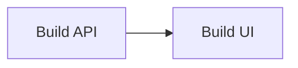
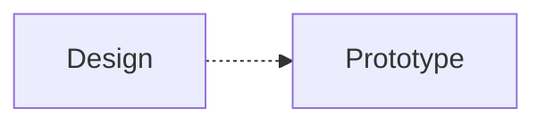
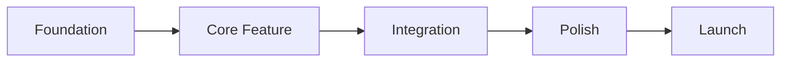
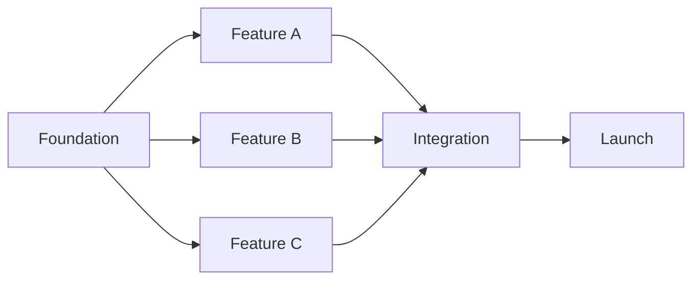
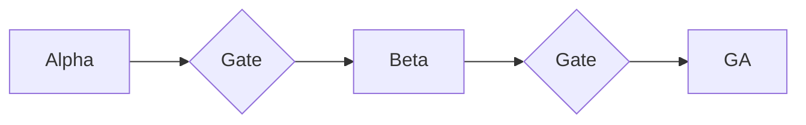
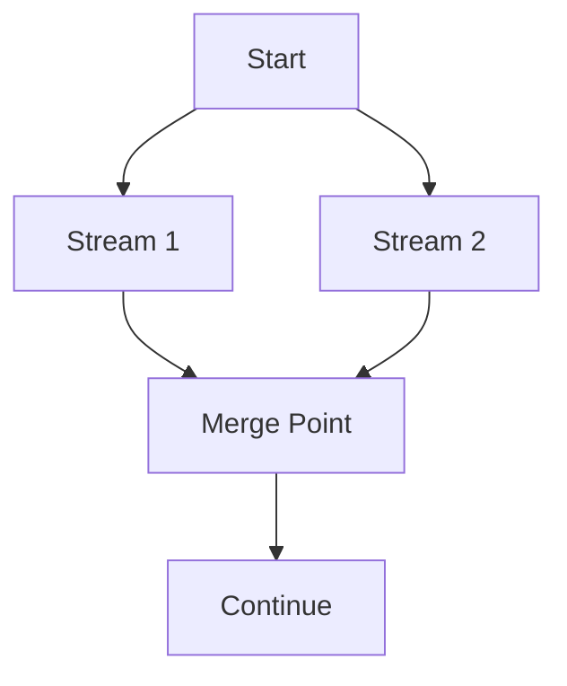
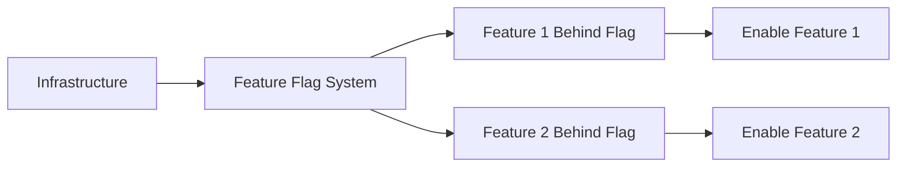
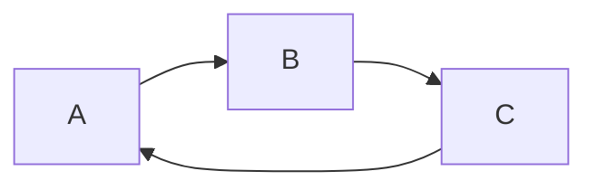

# Dependency Patterns

Common dependency patterns in research-to-production roadmaps.

## Dependency Types

### Finish-to-Start (FS) - Most Common
B can't start until A finishes.



**Example:** Can't build UI until API is ready.

### Start-to-Start (SS)
B can start when A starts.



**Example:** Can start prototyping as soon as design starts.

### Finish-to-Finish (FF)
B can't finish until A finishes.


**Example:** Documentation can't be finalized until feature is complete.

## Common Roadmap Patterns

### Linear Pipeline

Simple sequential execution:



**When to use:** Small team, clear dependencies, limited parallelism possible.

**Risk:** Critical path is the entire project.

### Parallel Streams

Independent workstreams converge:



**When to use:** Team can split, features are independent until integration.

**Risk:** Integration is the bottleneck.

### Phased Rollout

Incremental delivery with gates:



**When to use:** Need validation before broader release, high-risk features.

**Risk:** Gates can become blockers if criteria unclear.

### Diamond Pattern

Diverge and reconverge:



**When to use:** Parallel development with integration point.

**Risk:** Merge point complexity underestimated.

### Feature Toggle Pattern

Ship infrastructure, enable features incrementally:



**When to use:** Need to ship early, control rollout, A/B test.

**Risk:** Flag complexity, cleanup debt.

## Critical Path Analysis

The critical path is the longest sequence of dependent tasks.

### Finding Critical Path

1. Map all dependencies
2. Calculate total duration of each path
3. Longest path = critical path
4. Any delay on critical path delays project

### Example

```
Path A: Foundation (4w) → API (3w) → Integration (2w) = 9 weeks
Path B: Foundation (4w) → UI (4w) → Integration (2w) = 10 weeks ← CRITICAL
Path C: Foundation (4w) → Docs (2w) = 6 weeks
```

Critical path: Foundation → UI → Integration

### Managing Critical Path

| Strategy | Description |
|----------|-------------|
| **Fast-track** | Start next task before previous finishes (if possible) |
| **Crash** | Add resources to shorten duration |
| **Scope reduction** | Remove features from critical path |
| **Parallel paths** | Find opportunities for parallel work |

## Dependency Risk Management

### High-Risk Dependencies

| Type | Risk | Mitigation |
|------|------|------------|
| External team | Delayed delivery | Early alignment, regular check-ins |
| Third-party API | Breaking changes | Version pinning, abstraction layer |
| New technology | Learning curve | Spike early, training time |
| Single person | Bus factor | Knowledge sharing, pair work |
| Sequential critical path | Any delay cascades | Identify parallelism |

### Dependency Documentation

For each dependency, document:

```markdown
### Dependency: [Name]

**Type:** Internal Team | External Team | Third Party | Technology
**Owner:** [Who is responsible]
**Status:** Confirmed | Tentative | At Risk
**Target Date:** [When needed by]

**Risk Level:** High | Medium | Low
**Risk Description:** [What could go wrong]

**Contingency Plan:**
[What we do if this dependency fails]

**Early Warning Signs:**
- [Sign 1]
- [Sign 2]
```

## Anti-Patterns

### Circular Dependency

**Problem:** Impossible to schedule
**Solution:** Break the cycle with an intermediate deliverable

### Hidden Dependency
Dependencies not explicitly tracked.
**Problem:** Surprise blockers
**Solution:** Explicit dependency mapping, regular review

### Assumed Availability
Assuming resources will be available.
**Problem:** Resource conflicts
**Solution:** Explicit resource allocation, capacity planning

### Big Bang Integration
Everything integrates at the end.
**Problem:** Integration hell
**Solution:** Continuous integration, incremental merges
